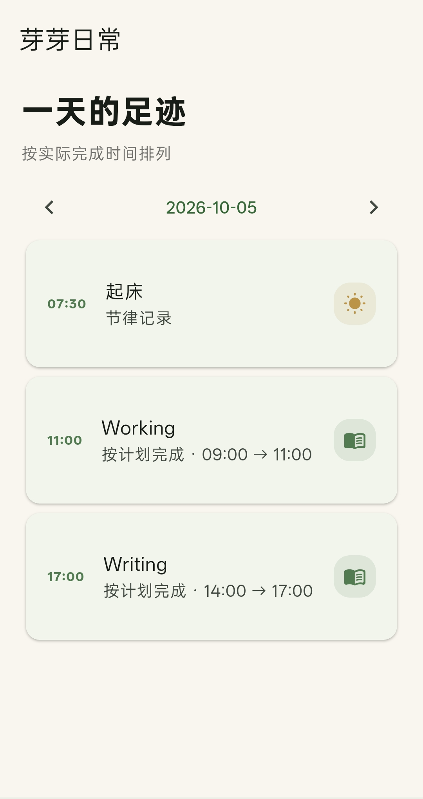
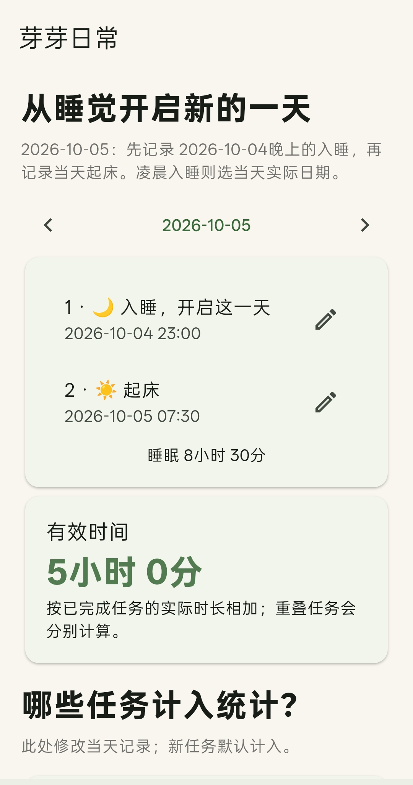
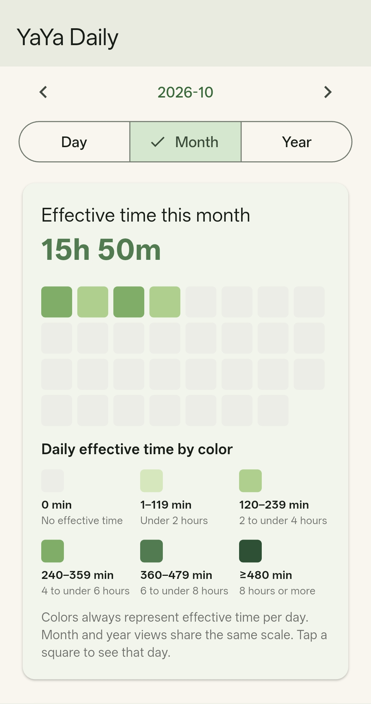
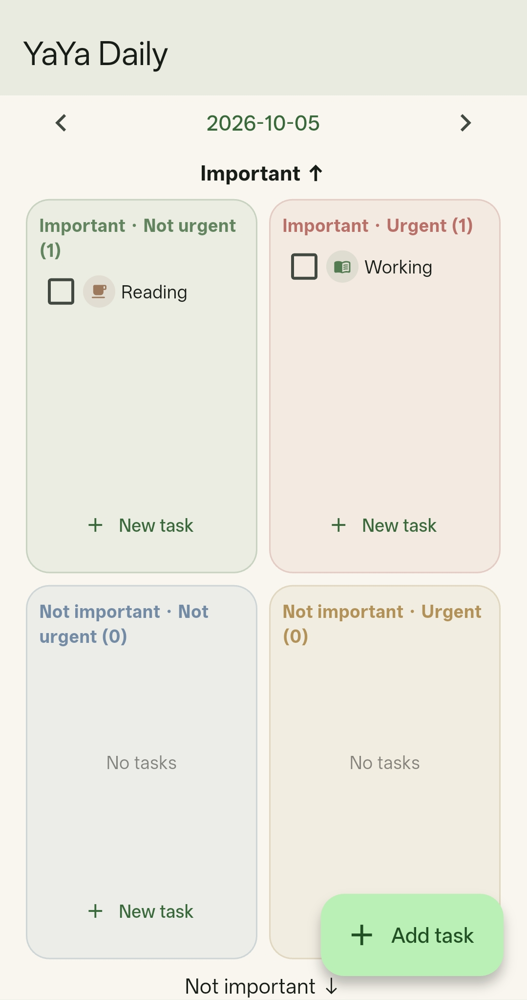
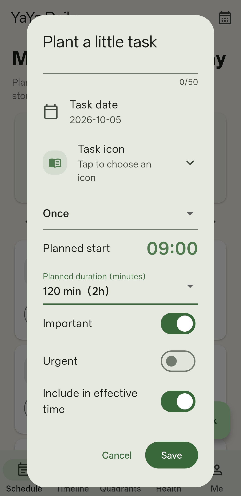

# YaYa Daily · 芽芽日常

A simple time management app. Available in Chinese and English.

**Version:** 0.6.4 · Android

**Features:** Schedules · Timeline · Four-Quadrant Tasks · Focus Time · Sleep Recording · Offline · Backup

## App Preview

<table>
  <tr>
    <td></td>
    <td></td>
    <td></td>
    <td></td>
    <td></td>
  </tr>
  <tr>
    <td align="center">Schedule</td>
    <td align="center">Schedule</td>
    <td align="center">Schedule</td>
    <td align="center">Time Axis</td>
    <td align="center">Health</td>
  </tr>
</table>

## App Preview
More resources: https://xingyi-wu.github.io/resources.html
